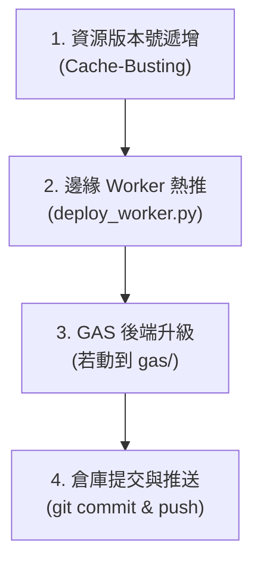

# 🚀 CardForge PWA 研發工程閉環與發布規範 (cardforge_pwa_release)

> [!IMPORTANT]
> **本專案為公網雙網域 PWA 旗艦專案**：
> 1. 🍵 `https://card.teaforia.in`
> 2. 🏢 `https://card.foxlink.co.in`
> **任何 AI 代理人修改代碼後，絕對禁止僅在本地修改了事！必須 100% 嚴格遵循以下 4 步發布閉環，否則線上使用者永遠只會吃到快取的舊代碼！**

---

## 🏗️ 代理人發布標準 4 步閉環 (Standard 4-Step Release Lifecycle)



---

### 📌 步驟 1：資源版本號遞增 (Cache-Busting Invariant)
當修改了 `js/`、`css/`、`core/` 或 `styles/` 下的任何檔案時，必須同步在引用該檔案的 HTML 中**遞增版本號 query 參數**（例如 `?v=2` ➔ `?v=3`），防止瀏覽器與 PWA Service Worker 強烈快取舊腳本：
- **`workspace.html`**：
  - `js/workspace_views.js?v=X`
  - `js/editor_views.js?v=X`
  - `js/workspace_store.js?v=X`
- **`play.html`**：
  - `core/CardEngine.js?v=X`
  - `core/BackdropShader.js?v=X`
  - `js/workspace_store.js?v=X`

---

### 📌 步驟 2：Cloudflare Worker 雙網域熱推 (Edge Worker Invariant)
若修改了 `cloudflare/worker_og_proxy.js`，**必須立即執行**：
```bash
py scripts\deploy_worker.py
```
- 此腳本會自動同步熱推至 `card.teaforia.in` 與 `card.foxlink.co.in` 雙邊緣節點。
- 驗證雙網域均回傳 `200 OK` 且代理狀態為 `🟠 Proxied`。

---

### 📌 步驟 3：GAS 雲端後端部署 (若有異動)
若修改了 `gas/Card_Gateway.gs`，**必須強制立即執行**：
```bash
py C:\Users\9892\.gemini\config\skills\gas_clasp_manager\scripts\clasp_manager.py push --name greeting_card_gateway
py C:\Users\9892\.gemini\config\skills\gas_clasp_manager\scripts\clasp_manager.py deploy --name greeting_card_gateway --desc "版本說明"
```

---

### 📌 步驟 4：Git 提交與遠端推送 (Git Push Closing)
所有前端靜態頁面託管於 GitHub Pages：
1. 先檢查修改狀態：`git status`
2. 提交變更：`git commit -am "chore/fix: 變更說明"`
3. **推送到遠端**：`git push origin main`（或當前分支）。
   - GitHub Pages 約在 30 秒至 1 分鐘內完成全球 CDN 部署。
