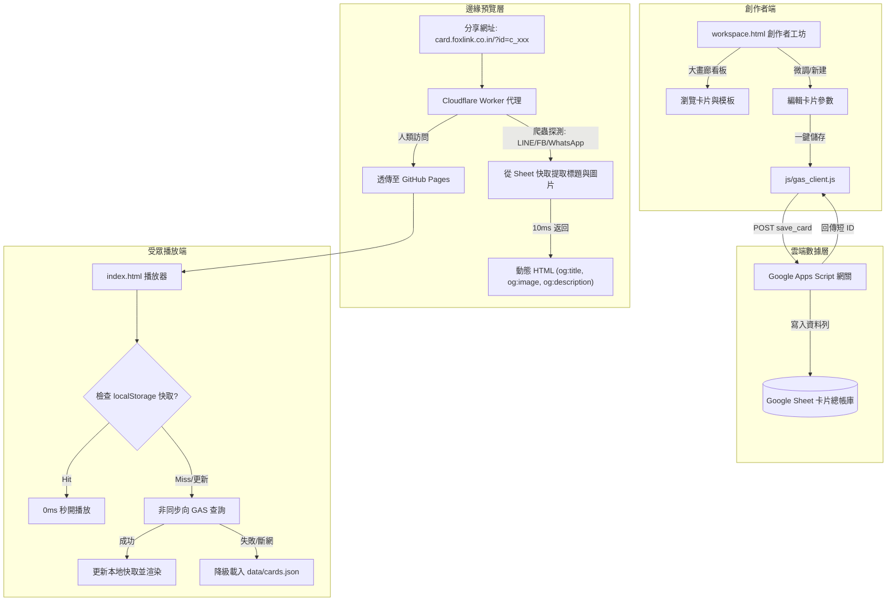

# 📜 CardForge 雲端持久化與社交動態預覽產品需求規格書 (PRD)

> **版本**：v2.0 (Cloud & Edge Architecture)  
> **制定日期**：2026-09-20  
> **系統代號**：CardForge (`greeting-card-music`)

---

## 1. 產品背景與痛點 (Problem Statement)

`CardForge` 是一套融合 WebGL 絲綢著色器、Three.js 3D 粒子星空與立體音訊的高質感沉浸式音樂賀卡系統。在先前的架構中，所有賀卡資料與版型均以靜態 JSON（`data/cards.json`、`data/templates.json`）的形式託管於 GitHub Pages。

### 核心痛點：
1. **數值改動依賴 Git Commit**：
   - 創作者每微調一句祝福語、更換音樂或客製化一張卡片，都必須發起一次 `git commit` 與 `git push`，等待 GitHub Pages 構建 1~3 分鐘，無法實現「線上即時儲存、隨時分享」。
2. **社群分享無預覽 (No Social Preview / OG Meta)**：
   - LINE、Facebook、WeChat、WhatsApp 等通訊軟體爬蟲**不執行客戶端 JavaScript**。傳統純靜態 CSR（Client-Side Rendering）架構回傳的頁面無法動態帶出每張卡片的客製化標題、封面圖與祝福摘要，導致聊天視窗僅顯示冰冷死板的通用文字或空白預覽。
3. **專案目錄混亂與技術債累積**：
   - 歷史 React/Trickle 模板殘存未引用廢代碼（如 `app.js`、`components/`）。
   - 音訊資源未妥善歸納於資源目錄。
   - `workspace.html` 單檔高達 76KB，樣式與腳本高度耦合。

---

## 2. 產品目標與願景 (Objectives & OKRs)

- **O1：零 Git Commit 雲端即時持久化**
  - 提供 Google Sheet 雲端 SSOT 資料儲存與輕量 GAS (Google Apps Script) 網關。
  - 工作台點擊「儲存至雲端」即刻生成永久卡片短 ID（如 `c_1786988344`）。
- **O2：社交動態預覽 100% 覆蓋 (Open Graph 邊緣注入)**
  - 透過 Cloudflare Worker 邊緣層，針對社群爬蟲（User-Agent 辨識）秒級注入 `<meta property="og:...">`。
  - 在 LINE / FB / WhatsApp / WeChat 聊天視窗中完美呈現卡片專屬封面與祝福語。
- **O3：目錄結構純淨化與工程治理**
  - 清理 100% 冗餘廢代碼，多媒體歸位至 `assets/audio/`。
  - 將 76KB `workspace.html` 模組化拆分為 `css/workspace.css`、`js/workspace.js` 與 `js/gas_client.js`。
  - 堅守「大畫廊優先 (Gallery-First)」鐵律，確保視覺體驗震撼。
- **O4：極限邊界防禦與高可用保底 (Zero-Crash Fallback)**
  - 支援 SWR（Stale-While-Revalidate）本地快取秒開。
  - 當 Google API 遇阻或離線時，自動無縫降級至本地內建精選卡片清單，確保播放器永遠不破圖、不白屏。

---

## 3. 系統整體架構 (System Architecture)

採用「**三角雙軌架構 (Triangle Dual-Track Architecture)**」：



---

## 4. 詳細模組規範與資料結構

### 4.1 Google Sheet 儲存結構 (`Cards_Store`)
| 欄位名稱 (Key) | 型態 | 說明 | 範例 |
| :--- | :--- | :--- | :--- |
| `id` | String | 卡片唯一標識 (短 ID) | `c_1786988344` |
| `title` | String | 卡片主標題 (用於預覽與畫廊) | `星夜之願 - 獻給 Alice 的生日祝福` |
| `sender` | String | 送件人署名 | `Leo` |
| `recipient` | String | 收件人稱謂 | `Alice` |
| `description` | String | 祝福短語摘要 (用於 og:description) | `願星光照亮妳新一歲的旅途，生日快樂！` |
| `imageUrl` | String | 封面圖片 URL (用於 og:image) | `https://.../cover.jpg` |
| `musicUrl` | String | 音訊檔案路徑或 URL | `assets/audio/In Love With You.mp3` |
| `templateId` | String | 關聯版型風格 ID | `tpl_starwars` / `tpl_silk` |
| `configJson` | Text | 完整卡片引擎參數 (JSON 字串) | `{"speed":1.2, "particleColor":"#d4af37", ...}` |
| `updatedAt` | DateTime | 最後修改時間 | `2026-09-20 20:30:00` |

### 4.2 GAS 網關 API 規格 (`gas/Card_Gateway.gs`)
- **端點 Method**：`GET` 與 `POST`
- **Actions**：
  1. `save_card` (POST)：儲存或更新卡片資料，回傳 `{ success: true, id: "c_xxx", shareUrl: "..." }`。
  2. `get_card` (GET)：以 `?action=get_card&id=c_xxx` 查詢單張卡片，回傳卡片完整物件。
  3. `list_cards` (GET)：查詢最新公開卡片清單供工作台畫廊展示。

### 4.3 Cloudflare Worker 邊緣預覽代理 (`cloudflare/worker_og_proxy.js`)
- **爬蟲特徵正則**：
  `facebookexternalhit|Twitterbot|LinkedInBot|WhatsApp|LineBot|Discordbot|TelegramBot|Slackbot|SkypeUriPreview`
- **行為**：
  - 命中爬蟲：Worker 使用 subrequest 向 Google Sheet API 快取拉取元數據，組裝 `<head><meta property="og:title" ...><meta property="og:image" ...></head>` 並直接回傳。
  - 未命中爬蟲：直接 `fetch(request)` 透傳至 GitHub Pages，保持 SPA/WebGL 正常運作。

---

## 5. 目錄重構與代碼瘦身規劃

```text
greeting-card-music/
├── assets/
│   ├── audio/
│   │   └── In Love With You.mp3     # 收納音訊檔案
│   └── images/
├── core/
│   ├── BackdropShader.js
│   ├── CardEngine.js
│   └── ParticleEngine.js
├── css/
│   ├── animations.css
│   ├── player.css
│   └── workspace.css                # 抽離自 workspace.html
├── js/
│   ├── gas_client.js                # 雲端資料對接模組
│   └── workspace.js                 # 工作台畫廊與編輯器邏輯
├── data/
│   ├── cards.json                   # 離線精選卡片保底
│   └── templates.json               # 預設版型風格
├── docs/
│   ├── PRD.md                       # 本需求規格書
│   ├── STATE.md                     # 架構不變量 (≤200行)
│   └── ACTIVE_LOG.md                # 變更日誌
├── gas/
│   └── Card_Gateway.gs              # Google Apps Script 萬能網關
├── cloudflare/
│   └── worker_og_proxy.js           # Cloudflare Worker 邊緣社交預覽代理
├── index.html                       # 受眾端播放器 (SWR + 雲端短 ID 支援)
├── workspace.html                   # 創作者工坊 (大畫廊看板 + 雲端儲存)
└── AGENTS.md                        # 開發模式規範
```

---

## 6. 驗收標準 (Acceptance Criteria)

1. **目錄乾淨度**：專案根目錄不再留存裸奔音訊檔，完全無未引用的歷史 React 廢棄代碼。
2. **大畫廊鐵律**：開啟 `workspace.html` 依然預設呈現震撼的大畫廊看板與卡片/模板雙分頁，微調 Modal 與預覽 Modal 運作正常。
3. **雲端支援度**：支援在工作台直接一鍵發布至雲端並生成短分享連結，不再強制依賴 Git Commit。
4. **受眾播放度**：`index.html` 能平滑載入本地與雲端卡片，音訊正常播放，離線時自動保底不報錯。
